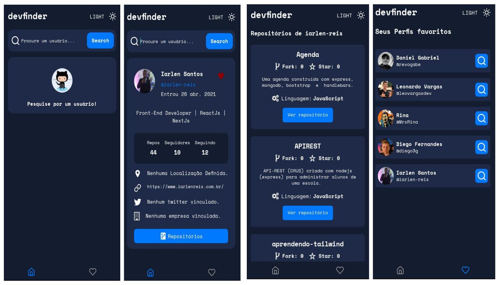
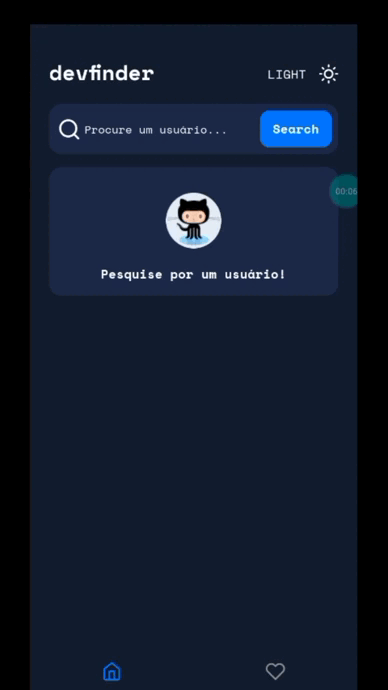
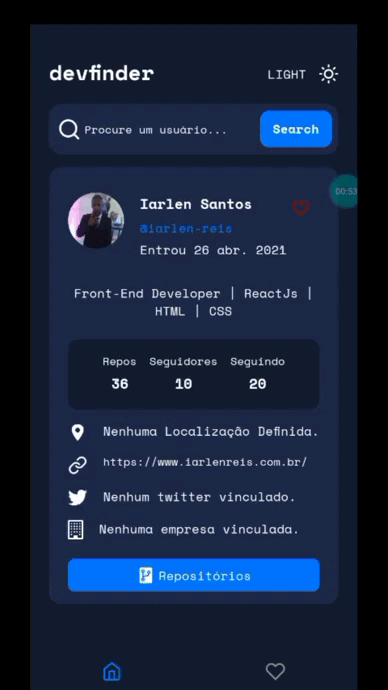
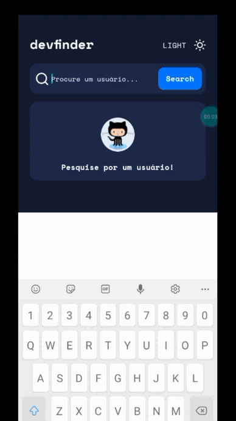

# Devfinder
### 

  Devfinder foi um desafio do <a href="https://www.frontendmentor.io/">Frontend Mentor</a>, onde
  devemos construir uma aplicação baseada no layout do <a href="https://www.figma.com/file/vkOOTqx4EmCy097dTvmIbZ/github-user-search-app?type=design&node-id=0%3A1&t=lWLpfANyhktirJN7-1">figma</a> proposto por eles.</a>. O projeto foi desenvolvido para
  ser uma aplicação web, onde o usuário procura por pessoas do github a partir do seu
  username.

  No meu caso, utilizei o figma disponibilizado por eles para desenvolver uma aplicação mobile, utilizando react native (Expo), Typescript e estilização feita com nativewind.
  A aplicação tem todas as funcionalidades requeridas no desafio web, além disso, o layout da aplicação seguiu fielmente o figma do projeto.

  No decorrer do desenvolvimento, foram adicionandas algumas funcionalidades a mais,
  entre elas:

<ul>
  <li>
    <b>Listagem de repositórios:</b> É possível listar todos os repositórios publicos de um usuário e 
    também é possível ir a um repositório especifico clicando no botão "Ver repositório".
  </li>
    <li>
    <b>Favoritar um perfil:</b> É possível adicionar um perfil na sua lista de favoritos, o armazenamento dos perfil favoritados foi feito utilizando AsyncStorage. Além disso,
    também é possível listar todos os perfil que foram adicionandos a lista de favoritos e
    exclui-lo da lista.
  </li>
</ul>

## O que foi utilizado?

<ul>
  <li>
    <b>ContextAPI:</b> Foi utilizado contextAPI para fazer o gerencimento de estado da aplicação,
    como por exemplo, gerenciar o tema da aplicação, informações do perfil e na funcionalidade
    de favoritos.
  </li>
    <li>
    <b>AsyncStorage:</b> Foi utilizado para armazenar os dados dos usuários adicionados como favoritos e para armazenar o tema da aplicação.
  </li>
  <li>
    <b>Axios:</b> Foi utilizado para fazer as requisições a API do github.
  </li>
  <li>
    <b>React Query:</b> Foi utilizado para fazer cache dos repositórios do usuário.
  </li>
</ul>

## Funcionalidades 🛠️

- [x] exibir perfil do usuário.
- [x] Dark mode.

## Melhorias 🛠️

- [x] Listagem de repositórios do usuário.
- [x] funcionalidade de visitar um repositório do usuário.
- [x] Funcionalidade de adicionar um usuário aos favoritos.
- [x] Listagem de usuários favoritos.
- [ ] Melhorar a reponsividade.

## Gifs das telas
<table>
  <tr>
    <td align="center">
      <label>Página inical: Pesquisa</label>
       
      
    </td>
    <td align="center">
      <label>Repositórios: listando repositórios</label>
       
      
    </td>
  </tr>
  <tr>
    <td align="center">
      <label>Favoritos: Adicionando aos favoritos</label>
       
      
    </td>
    <td align="center">
      <label>Usuário não encontrado (Pesquisa)</label>
       
      
    </td>
  </tr>
</table>

## Tecnologias

- [Expo: Docs](https://docs.expo.dev/)
- [Expo Router: Docs](https://expo.github.io/router)
- [Typescript: Docs](https://www.typescriptlang.org/)
- [Nativewind: Docs](https://www.nativewind.dev/)
- [GithubAPI: Docs](https://docs.github.com/pt/rest?apiVersion=2022-11-28)
- [AsyncStorage: Docs](https://reactnative.dev/docs/asyncstorage)
